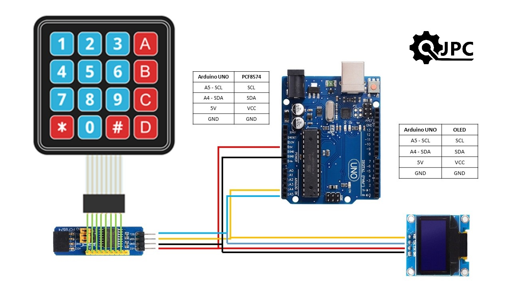
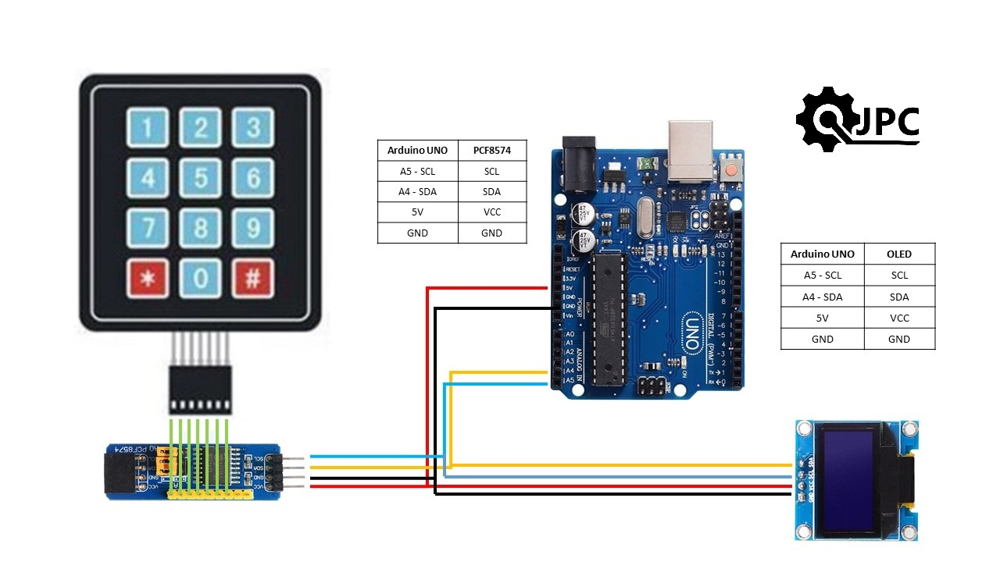
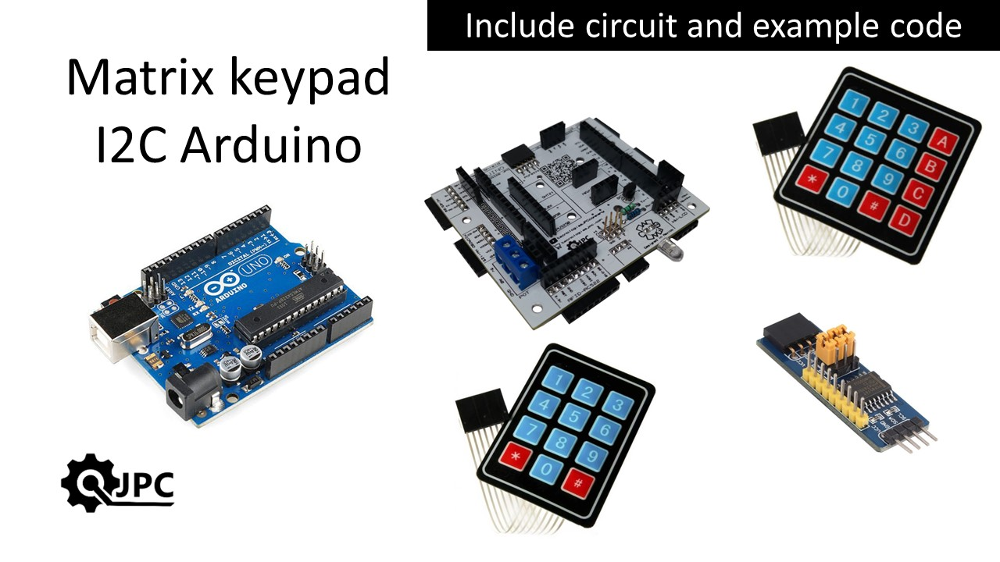

# Connections diagram
Verify these connections are correctly done for arduino board and perifericos.
For 4x4 keypad

For 3x3 keypad these are the required connections.

# Instructional video available on youtube
For a more precise process, this is the video guideline.

